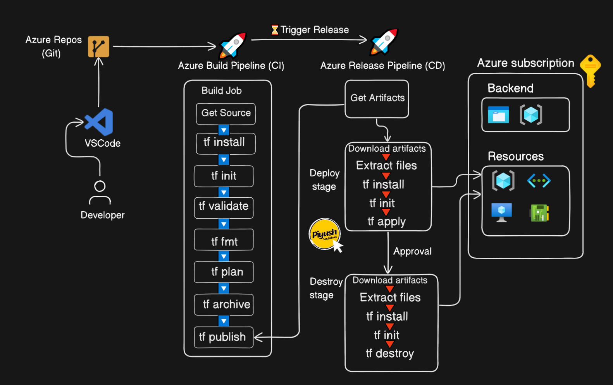
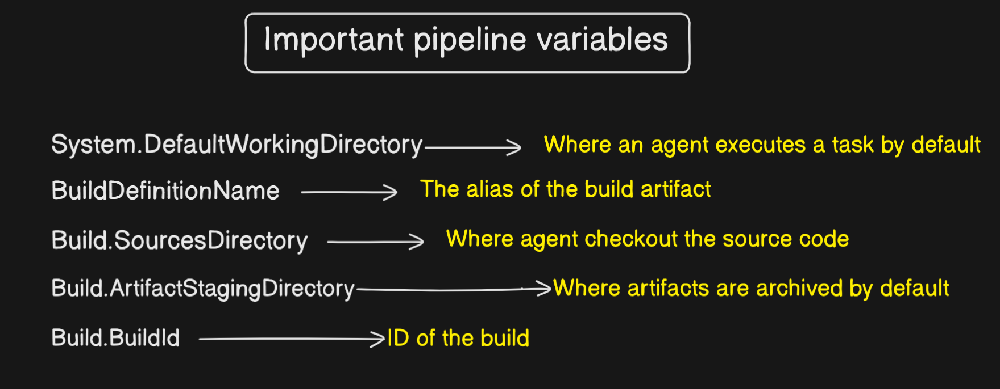

# Azure-Resources-Creation-using-Terraform-Azure-Pipeline

Creating Azure resources using Terraform in an Azure Pipeline involves setting up a CI/CD pipeline that automates the infrastructure deployment process.

**Basic Requirement:**
1. Set Up Your Azure DevOps Account:
    Setup the Azure Devops account
2. Create a Project: 
   Navigate to your Azure DevOps organization and create a new project.
3. Terraform Installed: 
   Ensure Terraform is installed on your machine
4. Create Terraform Configuration Files:
    Write Terraform configuration files (.tf files) that define the Azure resources you want to create
5. Backend Configuration:
   To store the terraform state file created azure backend configuration using azure storage service.    
6. Create a Pipelines:
   Set up a repository: 
   Push your Terraform files to a repository in Azure Repos, GitHub, or another source control system.
   Create a new pipeline: 
   In Azure DevOps, navigate to Pipelines > New Pipeline
   Define the pipeline in YAML: 
   Create a azure-pipelines.yml file in the root of the repository

Azure DevOps CICD Pipeline:

Pipeline Variables Details:

Terraform Service Principal(Client id, Tenant id, CLient Secret, Subscription id):

To use a Terraform service principal in an Azure Pipeline,store the service principal credentials securely in your pipeline library or variable groups.

